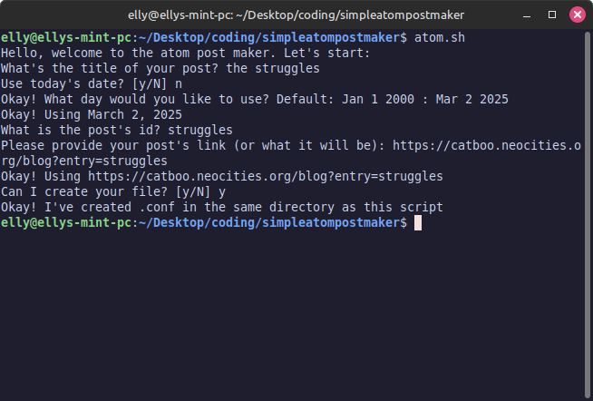

# <p align="center">a simple atom post maker</p>


it's what the title says! sapm (acronym) is written in bash by someone who knows way too little about bash
    
## 🛠️ features 
- generates an atom post*
- customizable templates & config files
- easily swappable `content.html` for easier post making

> *you still need to copy and paste it to your atom file

## requirements
- be running linux
- be running macos (untested)
<!-- windows can't really run bash r.i.p.  -->

## 💡 usage
1. make your `content.html`
2. run `atom.sh` and create your `atom.conf` file
3. configure your `atom.tpl`
4. configure your `author.conf`
5. run `make.sh`
6. copy the contents of `out.txt` to your `.atom` file

### 💻️ about `content.html`
i decided to use a `.html` since it still allowed me to see if the syntax was correct. please still format it to xhtml standarts, or else the feed readers will freak out. keep in mind the syntax the readers accept, as well

### ⚙️ about `atom.tpl`
this is your atom template! configure to your heart's content. there's a single element you **will** need to customize, which is the `<id>` tag.
i have it set up as this string:

```
tag:catboo.neocities.org,${IDDATE}:/blog-${ID}
```
which would look something like this:
```
tag:catboo.neocities.org,2025-07-03:/blog-catboobday
```
my template is the following:
- always start with tag:
- after tag, goes the html
- after the first `/`, goes a `,` and today's date, followed by a :
- the rest of the url goes after the date*
- replace `#`* with `-`
> i used to use ids to refer to my blog posts, so this is half true... my urls usually include `?entry=` instead of that now
  
## 🍰 contributing    
contributions are greatly appreciated since this might not be very functional, especially on macos
        
## ➤ license
distributed under the MIT license. see [LICENSE](LICENSE) for more information.
        